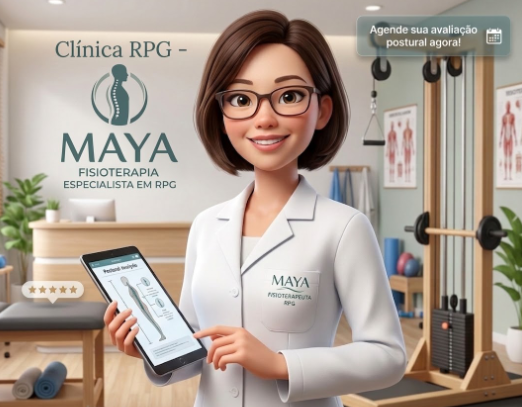

# FECAP - Fundação de Comércio Álvares Penteado

<p align="center">
<a href= "https://www.fecap.br/"></a>
</p>

# Sistema Mobile – Clínica Maya Yoshiko Yamamoto

## ERECTUS 

## Integrantes: <a href="https://www.linkedin.com/in/gustavomoura3112?utm_source=share&utm_campaign=share_via&utm_content=profile&utm_medium=android_app">Gustavo Moura</a>, <a href="https://www.linkedin.com/in/lucas-soares-corsino-885306288/">Lucas Corsino</a> , Guilherme Gomes Salvadeo, <a href="https://www.linkedin.com/in/manoel-rondon">Manoel Rondon, <a href="https://www.linkedin.com">Matheus</a>

## Professores Orientadores: <a href="https://www.linkedin.com/in/victorbarq/">Dr. Victor Von Doom</a>, <a href="https://www.linkedin.com/in/victorbarq/">Me. Saitama</a>, <a href="https://www.linkedin.com/in/victorbarq/">Dr. Strange</a>, <a href="https://www.linkedin.com/in/victorbarq/">Me. Yoda</a>, <a href="https://www.linkedin.com/in/victorbarq/">Dr. Gero</a>

## Descrição

<p align="center">
  
  <br>
  <span style="font-size: 14px;"><em>Interface e Identidade Visual do Sistema Clínica Maya - Fisioterapia & RPG.</em></span>
</p>

O projeto **Sistema Mobile - Clínica Maya** é uma plataforma integrada (Aplicativo Mobile e Módulo Web) desenvolvida para otimizar o acompanhamento de pacientes de fisioterapia, com foco especializado em Reeducação Postural Global (RPG). O objetivo da solução é digitalizar e centralizar a comunicação entre a fisioterapeuta Maya Yoshiko Yamamoto e seus pacientes, substituindo o envio disperso de mensagens e orientações por um ambiente dedicado, organizado e de fácil acesso.

Através do aplicativo mobile, os pacientes podem visualizar seus planos de exercícios diários com instruções detalhadas, além de realizar um "check-in" contínuo, registrando o nível de dor e dificuldade após cada execução. Simultaneamente, o módulo web (painel administrativo) permite que a profissional gerencie prontuários, prescreva novas rotinas de forma personalizada e acompanhe a evolução do tratamento em tempo real, garantindo maior engajamento e eficácia na recuperação.

---


## 🛠 Estrutura de pastas

-Raiz<br>
|<br>
|-->documentos<br>
  &emsp;|-->antigos<br>
  &emsp;|Documentação.docx<br>
|-->executáveis<br>
  &emsp;|-->windows<br>
  &emsp;|-->android<br>
  &emsp;|-->HTML<br>
|-->imagens<br>
|-->src<br>
  &emsp;|-->Backend<br>
  &emsp;|-->Frontend<br>
|readme.md<br>

A pasta raiz contem dois arquivos que devem ser alterados:

<b>README.MD</b>: Arquivo que serve como guia e explicação geral sobre seu projeto. O mesmo que você está lendo agora.

Há também 4 pastas que seguem da seguinte forma:

<b>documentos</b>: Toda a documentação estará nesta pasta.

<b>executáveis</b>: Binários e executáveis do projeto devem estar nesta pasta.

<b>imagens</b>: Imagens do sistema

<b>src</b>: Pasta que contém o código fonte.

## 🛠 Instalação

<b>Android:</b>

Faça o Download do JOGO.apk no seu celular.
Execute o APK e siga as instruções de seu telefone.

```sh
Coloque código do prompt de comnando se for necessário
```

<b>Windows:</b>

Não há instalação! Apenas executável!
Encontre o JOGO.exe na pasta executáveis e execute-o como qualquer outro programa.

```sh
Coloque código do prompt de comnando se for necessário
```

<b>HTML:</b>

Não há instalação!
Encontre o index.html na pasta executáveis e execute-o como uma página WEB (através de algum browser).

## 💻 Configuração para Desenvolvimento

Descreva como instalar todas as dependências para desenvolvimento e como rodar um test-suite automatizado de algum tipo. Se necessário, faça isso para múltiplas plataformas.

Para abrir este projeto você necessita das seguintes ferramentas:

-<a href="https://godotengine.org/download">GODOT</a>

```sh
make install
npm test
Coloque código do prompt de comnando se for necessário
```

## 📋 Licença/License
Utilize o link <https://chooser-beta.creativecommons.org/> para fazer uma licença CC BY 4.0.

## 🎓 Referências

Aqui estão as referências usadas no projeto.

1. <https://github.com/iuricode/readme-template>
2. <https://github.com/gabrieldejesus/readme-model>
3. <https://chooser-beta.creativecommons.org/>
4. <https://freesound.org/>
5. <https://www.toptal.com/developers/gitignore>
6. Músicas por: <a href="https://freesound.org/people/DaveJf/sounds/616544/"> DaveJf </a> e <a href="https://freesound.org/people/DRFX/sounds/338986/"> DRFX </a> ambas com Licença CC 0.
